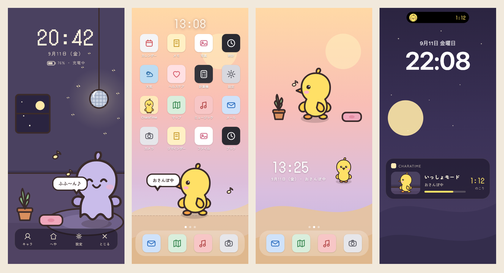
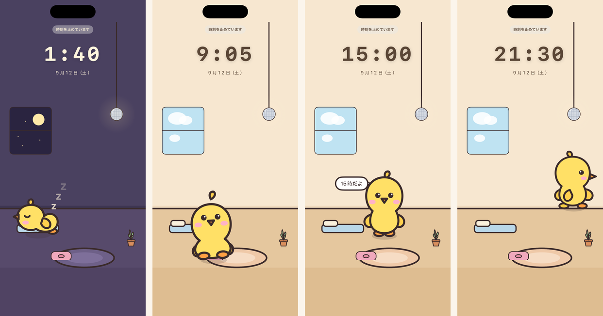
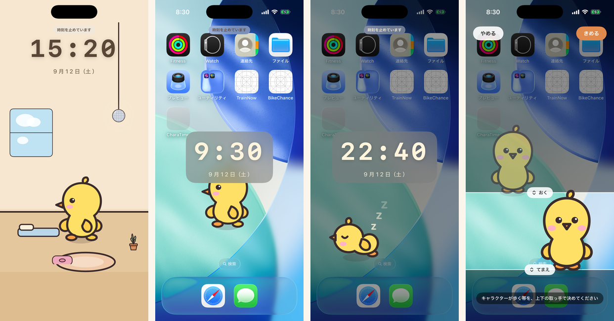

# CharaTime

**iPhone の中に小さなキャラクターが住んでいて、見ていないあいだも勝手に生きている。**

au ガラケー時代の待受サービス「ケータイパートナー（β版）」や docomo の「マチキャラ」が
持っていた体験 —— 画面を開くたびにそこにいて、放っておいても何かしていて、たまに話しかけてくる
—— を、2026 年の iPhone で再現する個人開発プロジェクトです。



> 上は **デザイン（実装目標）** です。左から、アプリ内の待受モード、
> ホーム画面のスクリーンショットの上を歩く様子、透過ウィジェット、
> ロック画面の「いっしょモード」。

## いまの状態

**Phase 1（待受モード）**。キャラクターが部屋で自律的に暮らすところまで動いています。



> 実際に動いている画面です。左から、就寝中、朝のひと休み、毎正時の時報、夜の散歩。
> 時刻はデバッグ用に固定して撮っています。

背景は 3 系統から選べます。**ホーム画面のスクリーンショットを選ぶと、
アイコンが並んだ画面の上をキャラクターが歩きます。**



> 左から、同梱のへや、ホーム画面の上（昼）、同（夜）、歩ける帯を決める画面。

- **日課エンジン**が日付と種から一日の予定を組み、時刻を渡すと「そのときの姿」を返す
- どの時刻を引いても同じ答えになるので、**ウィジェットで見た姿とアプリを開いた姿が一致する**
- 12 枚の絵に、呼吸・弾み・首のかしげを**時刻の関数**として足して動かす
- 22 時から夜モード。時計・日付・電池はガラケー風とすっきりの 2 種
- 背景は同梱のへや／写真／ホーム画面のスクリーンショットから選べる
- `swift test` 163 件が数秒で通る

## 考えていること

iOS はアプリがホーム画面に直接描画できません。ウィジェットも 1 日 40〜70 回の
静止画差し替えが上限で、秒単位のアニメーションは Apple が推奨していない手法でしか作れません。

そこで **複数の「面」で分担する**構成にしています。

| 面 | 何を担うか | 動きの質 |
|---|---|---|
| 待受モード（アプリ内） | 「勝手に生きている」体験の核 | 60fps で自由に歩く |
| ホーム画面ウィジェット | 「ホーム画面にいる」 | 5〜10 分ごとに姿と位置が変わる |
| StandBy | 充電スタンドの待受 | 同上 |
| Live Activity | 「いっしょモード」（1・2・4 時間のセッション） | 状態表示 |
| 壁紙 | ロック解除のたびに違う場所にいる | 静止画 |

すべての面が **同じ決定論的なシミュレーション**（日課エンジン）を、同じ入力で呼びます。
日付と種から 1 日の行動表を作り、任意の時刻の姿を O(1) で返すので、
ウィジェットは 3 時間後の姿を先読みでき、アプリを閉じているあいだも
「その時間ずっと生きていた」場所にキャラがいます。

## 構成

```
docs/       開発プラン（260910_dev_plan.md）と、その根拠になった調査報告 6 本
design/     キャラクターと画面イメージ。chara.py が 5 体 × 7 ポーズの SVG を生成する
ios/
  Packages/
    CTCore    決定論ハッシュ・添字で引く乱数・部屋の座標・日課エンジンの型（UI 非依存）
    CTAssets  characters.json / items.json と読み出し口
    CTStore   App Group の state.json
    CTRender  SwiftUI 描画と、描画段のフォールバック
  CharaTime/        アプリ本体（薄い殻）
  CharaTimeWidget/  ウィジェット拡張
scripts/    検証ループ
```

## 動かす

```bash
scripts/check.sh                 # lint → 警告ゼロのビルド → テスト（いちばん軽い）
scripts/ios-loop.sh              # 上記 → 生成 → ビルド → 起動 → スクリーンショット
scripts/ios-loop.sh --time 20:30 # その時刻の姿を撮る
scripts/shots.sh 07:10 12:30 20:45   # 時刻を変えながら何枚か撮る（ビルドしない）
python3 tools/pipeline/pipeline.py   # design/ の SVG から絵を焼き直す
```

必要なもの: Xcode 26.6 以降、`brew install xcodegen xcbeautify swiftlint`。
`.xcodeproj` は生成物なので追跡していません。`xcodegen generate` で作られます。

## 読むもの

- [`docs/260910_dev_plan.md`](docs/260910_dev_plan.md) — 開発プラン。設計の判断と、その理由
- [`docs/research/`](docs/research/) — iOS の制約、生成 AI のパイプライン、先行アプリ、
  元ネタの史実を一次情報で調べた報告

## キャラクター

5 体（ピヨ・モチ・クマオ・フワ・チップ）。`design/chara.py` が SVG を生成します。
画風は「まるっとフラット」で、
2 頭身・太さ一定の輪郭線・ベタ塗り・1 体 4 色まで。突起を 1 つだけ持たせて、
ウィジェットの 40pt でも誰か分かるようにしています。

サンリオ等の既存キャラクターの識別要素は使っていません。

## ライセンス

**全権利を留保します。ライセンスは許諾していません。** → [LICENSE](LICENSE)

公開しているのは、個人開発の過程を見られる形にしておきたいからで、
自由に使ってよいという意味ではありません。閲覧とフォーク（GitHub の利用規約が
認める範囲）はご自由にどうぞ。利用をご希望の場合は Issues でご相談ください。

`docs/research/` の調査報告には第三者の公開文書からの引用が含まれます。
引用部分の権利は各権利者に帰属します。
